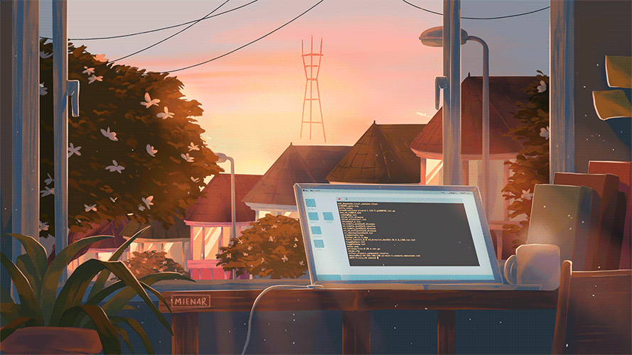

### Hi there 👋

# ✨ _special_ ✨ 

<h1 align="center">Hi 👋, I'm Trinh Tien Dat</h1>
<h3 align="center">A passionate fullstack developer from Viet Nam</h3>

<!-- add base number -->
<!-- animated coding gif -->

- 🌱 I’m currently learning **Fullstack Web**

- 🤝 I am looking for a study partner to progress together in university.

- 👨‍💻 All of my projects are available at [ REPOSITORIES](https://github.com/Meo2k?tab=repositories)

- 💬 Ask me about **something** you need

- 📫 How to reach me **mailto: lovecatdat@gmail.com**

- 📄 Know about my experiences **"Must go through to grow up"**
 
 
 
 
 
<h2 align="center">🛠 Technologies and Tools 🛠</h2>
 
<!-- https://simpleicons.org/ -->
<!-- 
&nbsp; -->

                            

 
<h2 align="center">🔥 GitHub Stats 🔥</h2>
 

  
  

 
<h2 align="center">👽 Where to find me 👽</h2>
 
<!-- https://icons8.com -->

  
  
  
  
  
  <!-- https://icons8.com/icon/112159/telegram-app -->

 

<h2 align="center">📖 A few things about me 📖</h2>
 

  <a href="https://github.com/Meo2k" target="_blank">
    <strong>☕ Accept work related to the web (Front-end and Back-end)</strong>
  </a>

<!-- 
<strong>☕ I am confident in supporting other subjects at school, this semester: IOT, image processing</strong>
 -->

<strong>☕ Some of the things I like are volleyball, codding, jogging, listening music </strong>

  <!-- <strong>🔗 Link giới thiệu chi tiết: <a href="https://youtu.be" target="_blank">Lập Trình SERN Stack Advanced</a></strong>
    -->
  <strong>🔗 Contact me: <a href="https://web.facebook.com/profile.php?id=100095196431285" target="_blank">Facebook</a></strong>
   
  <strong>📧 Or Email: <a href="lovecatdat@gmail.com" target="_top">lovecatdat@gmail.com</a></strong>

 

 
<h2 align="center">📑 My Favorites Quote 📑 : "Don't hesitate !!"</h2>
 

